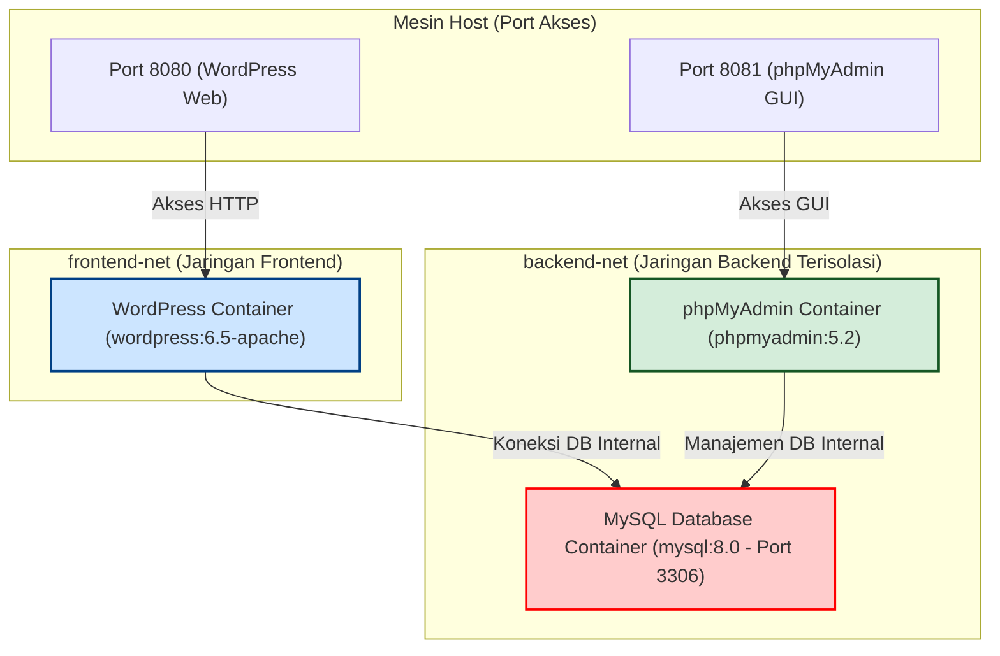

# 🌐 Secure WordPress Deployment with Docker Compose
> **Milestone 1 - Ujian Akhir Semester (UAS) Cloud Computing**  
> *Teknik Informatika - Semester 5*

<p align="center">
  
  
  
  
  
  
  
  
  
</p>

---

## 👥 Tim Pengembang (Contributors)
* **Rizqi Maulidiyah** - *Lead DevOps & Cloud Engineer* (NIM: 123456781)
* **Alfin Ardiansyah** - *QA Engineer & Technical Writer* (NIM: 123456782)

---

## 📌 Deskripsi Proyek
Proyek ini mengimplementasikan infrastruktur berbasis kontainer untuk mendeploy **WordPress** dengan arsitektur jaringan terisolasi menggunakan **Docker Compose**. Proyek ini menekankan pada konsep **keamanan jaringan (Zero-Trust isolation)**, manajemen dependensi berbasis **healthcheck**, dan pengamanan kredensial menggunakan berkas lingkungan variabel `.env` terenkripsi lokal.

---

## 🏗️ Arsitektur Sistem & Isolasi Jaringan
Kami merancang arsitektur sistem dengan membagi infrastruktur ke dalam dua jaringan kustom (`bridge`):
1. **`frontend-net`**: Mengizinkan akses HTTP luar menuju kontainer aplikasi WordPress.
2. **`backend-net`**: Jaringan internal terisolasi yang menghubungkan database MySQL dengan WordPress dan phpMyAdmin. MySQL sengaja dibuat **tidak mengekspos port ke mesin host** untuk mencegah ancaman eksploitasi eksternal langsung.

### Diagram Arsitektur Jaringan (Network Design)


---

## 🛠️ Stack Teknologi (Tech Stack)
* **Containerization**: Docker & Docker Compose
* **Application**: WordPress v6.5 (Apache base image)
* **Database**: MySQL v8.0 (Persistent Volume)
* **Database Tool**: phpMyAdmin v5.2
* **Scripting**: Bash (Automated project bootstrap)

---

## 📁 Struktur Direktori
```text
wordpress-docker/
├── mysql/                    # Tempat penyimpanan persistent data kontainer MySQL
├── wordpress/                # Tempat berkas WordPress lokal (jika diperlukan mount)
├── .env                      # File konfigurasi sensitif (tidak dicommit ke Git)
├── .env.example              # File template konfigurasi untuk distribusi publik
├── .gitignore                # Mengabaikan file sensitif agar tidak terunggah ke Git
├── docker-compose.yml        # Berkas orkestrasi Docker Compose utama
├── README.md                 # Dokumentasi portofolio proyek
└── kontribusi-anggota.txt    # Tabel pembagian tugas internal kelompok
```

---

## 🚀 Panduan Memulai & Instalasi

### Prasyarat
Pastikan mesin Anda memiliki dependensi berikut terpasang:
* **Docker Engine** v20.10+
* **Docker Compose** v2.0+

### Langkah-Langkah Deployment
1. **Clone Repositori**:
   ```bash
   git clone https://github.com/xafiertect/UAS_cloud_computing.git
   cd UAS_cloud_computing/wordpress-docker
   ```
2. **Setup Kredensial Lingkungan (.env)**:
   Salin template `.env.example` ke `.env` dan ganti kata sandi default dengan kata sandi yang kuat:
   ```bash
   cp .env.example .env
   ```
3. **Jalankan Orkestrasi Kontainer**:
   ```bash
   docker compose up -d
   ```
4. **Verifikasi Kontainer**:
   Pastikan seluruh layanan aktif dan berjalan:
   ```bash
   docker compose ps
   ```

---

## 🔍 Skenario Pengujian & Pengujian Kualitas (QA)
Guna menjamin keandalan sistem sebelum pengumpulan, tim QA melakukan serangkaian pengujian terstruktur:

| Kriteria Uji | Metode & Perintah Verifikasi | Status Diharapkan |
|--------------|------------------------------|--------------------|
| **Kesehatan Kontainer** | `docker compose ps` | Semua kontainer berstatus `running` & `mysql_db` berstatus `(healthy)` |
| **MySQL Healthcheck** | `docker inspect --format='{{json .State.Health.Status}}' mysql_db` | Menampilkan nilai `"healthy"` |
| **Isolasi Database** | `docker compose port db 3306` | Menghasilkan error/kosong (tidak boleh terakses dari host) |
| **Layanan Web HTTP** | `curl -I http://localhost:8080` | Respon HTTP/1.1 `302 Found` (redirect ke install wizard) |
| **Akses phpMyAdmin** | `curl -I http://localhost:8081` | Respon HTTP/1.1 `200 OK` |

---

## 🔒 Fitur Keamanan & Best Practice
* **Non-Root Database Port**: Port standard database MySQL `3060` tidak diekspos ke publik atau host eksternal untuk menghindari serangan brute-force.
* **Strict Dependencies with Healthchecks**: WordPress tidak akan dijalankan sebelum basis data MySQL melaporkan status siap (`healthy`).
* **Kredensial Terisolasi**: Penggunaan environment variable (`.env`) dinamis mencegah bocornya data sensitif (password root) ke repositori publik.
